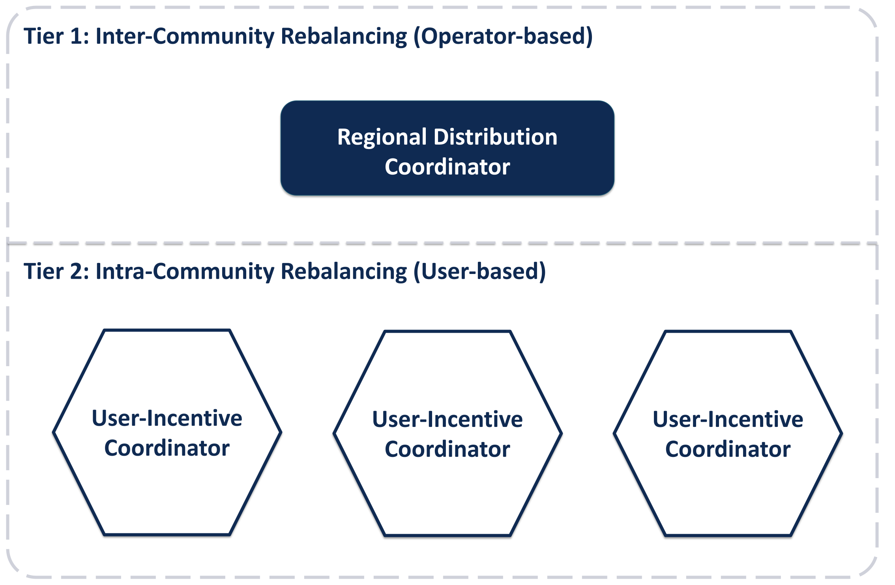
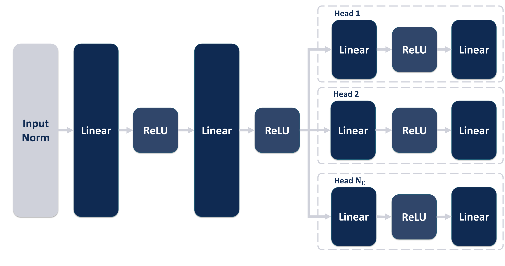
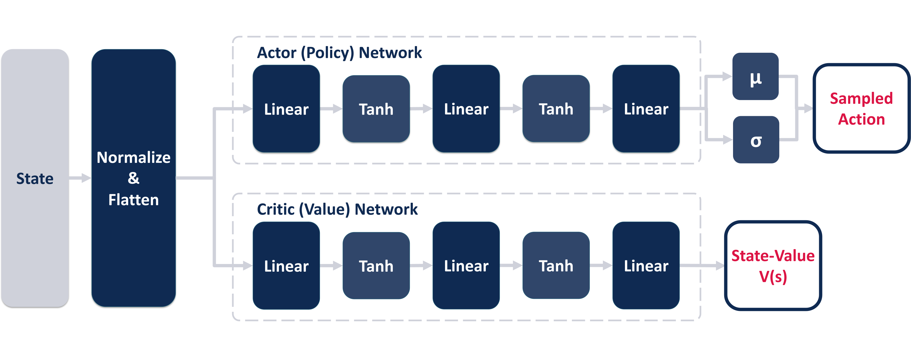
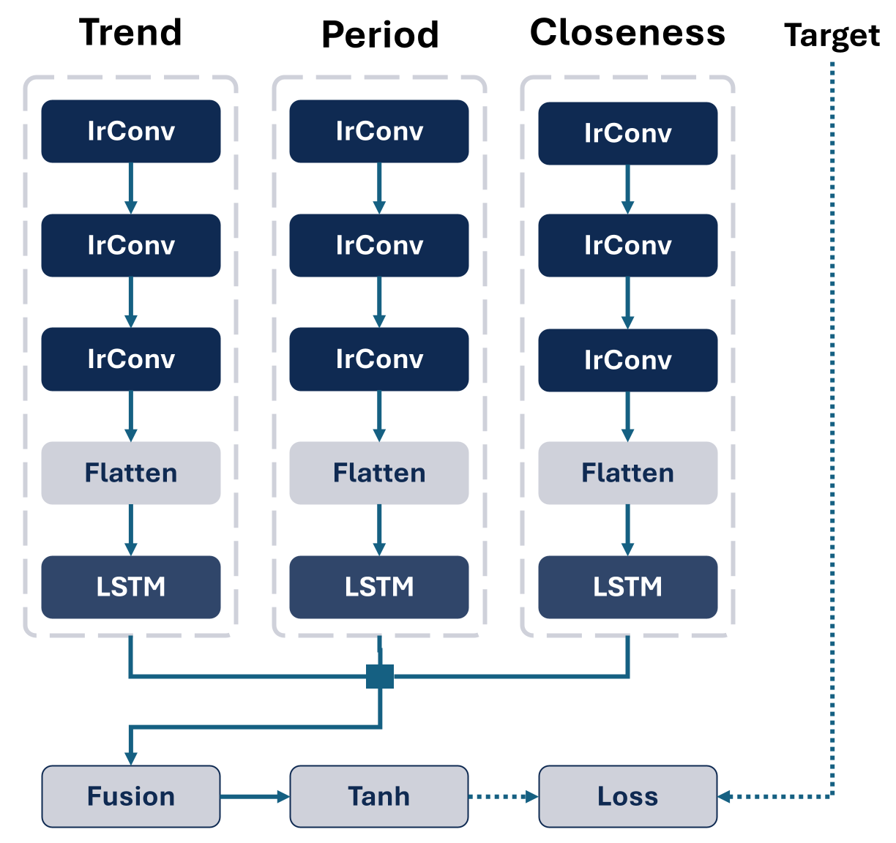

# Real-Time Suggestions for Optimizing Fleet Distribution of Sharing Services

A comprehensive hierarchical reinforcement learning (HRL) framework for e-scooter fleet management that integrates operator-based and user-based rebalancing strategies. This repository contains the official implementation for the Master's Thesis, "Real-Time Suggestions for Optimizing Fleet Distribution of Sharing Services" by Ruben Röhner.

## Abstract
Shared micromobility services have experienced a significant rise in popularity, leading to increased usage, which has resulted in challenges regarding service quality.
Due to the distinct usage patterns of such services, fleet imbalances occur, which decrease the quality of services and require a dynamic rebalancing strategy.
This thesis proposes a novel Hierarchical Reinforcement Learning (HRL) framework to address these challenges.
The framework decomposes the problem into two tiers: a highlevel Regional Distribution Coordinator (RDC) for operator-based rebalancing and a set of low-level User-Incentive Coordinators (UICs) for user-based incentives.
The high-level RDC focuses on strategic movements that address imbalances over the whole service area, while the UIC agents address local imbalances.
The framework was evaluated in a custom simulation environment against multiple baselines.
The results demonstrate that the high-level RDC agent of the HRL approach increased the Satisfied Demand Ratio (SDR) by 7.5% over the No-Rebalancing baseline while maintaining efficient use of rebalancing resources.
Counterintuitively, the combined HRL framework yielded slightly worse results, indicating improper coordination between the two levels of agents, which could be addressed in future work.

## Architecture
The framework decomposes the complex rebalancing problem into a two-tier hierarchy, supported by a dedicated demand forecasting module.


### Tier 1: Regional Distribution Coordinator (RDC)
The RDC is a single, high-level agent responsible for managing inter-community imbalances through strategic, operator-based rebalancing.
It observes the system state at a coarse, community level and determines target vehicle quotas for each community.
These decisions guide service crews in relocating vehicles from oversupplied communities to undersupplied ones.

- **Architecture:** Multi-head Deep Q-Network (MH-DQN) with Prioritized Experience Replay (PER) and Double DQN.
- **State**: Community-level vehicle counts, forecasted pick-ups, and forecasted drop-offs.
- **Action:**: A discrete vector of rebalancing quotas for each community (e.g., [-8, -4, -2, 0, 2, 4, 8] vehicles).
- **Objective:**: Maximize long-term service quality (Satisfied Demand Ratio) and fleet equity (low Gini coefficient) while minimizing operational costs due to rebalancing operations.




### Tier 2: User-Incentive Coordinators (UICs)
The second tier consists of multiple low-level UIC agents, with each agent assigned to a specific community to manage intra-community imbalances.
These agents operate at a finer, zone-level granularity, learning to offer optimal incentives to influence user drop-off behavior.
By encouraging users to end their trips in undersupplied zones, the UICs perform tactical adjustments to the local vehicle supply.

- **Architecture:** Proximal Policy Optimization (PPO) with a clipped surrogate objective and Generalized Advantage Estimation (GAE) for stable training.
- **State**: Zone-level vehicle counts, forecasted pick-ups, and forecasted drop-offs.
- **Action:**: A continuous vector of incentive levels (normalized between 0.0 and 1.0) for each zone within its community.
- **Objective:**: Maximize local service quality (Satisfied Demand Ratio) and fleet equity (low Gini coefficient) while minimizing operational costs due to offered incentives.


### Demand Forecasting Module
Both the RDC and UICs are supported by a dedicated module that provides accurate, real-time demand predictions. This allows the agents to learn proactive policies that anticipate future imbalances rather than simply reacting to current ones.

- **Algorithm:** An Irregular Convolutional Long Short-Term Memory (IrConvLSTM) neural network, adapted from Li et al. (2023).

- **Function:** Processes historical demand data through three parallel streams (Closeness, Period, and Trend) to capture short-term, daily, and weekly spatiotemporal patterns. It uses "semantic" convolutions to identify correlations between zones that are not geographically adjacent but share similar demand patterns.


## Getting Started
For detailed instructions on how to set up the environment and run the code, please see [INSTALL.md](INSTALL.md)

## Citation

If you use this framework in your research, please cite:

```bibtex
@mastersthesis{roehnerHRL2025,
  author       = {Ruben Röhner},
  title        = {Real-Time Suggestions for Optimizing Fleet Distribution of Sharing Services},
  school       = {Esslingen University},
  year         = {2025},
  month        = {August},
  type         = {Master's Thesis}
}
```

## Disclaimer

**Important Note on AI Assistance**: 

This codebase represents original research and implementation work. **Artificial Intelligence tools were used solely for generating code comments and docstrings to improve code documentation and readability.** 

All core algorithms, system architecture, research ideas, implementation logic, and technical solutions are the original intellectual work of the author. The AI assistance was limited exclusively to:

- Writing function and class docstrings
- Adding inline code comments
- Improving code documentation formatting

The research contributions, technical innovations, and all substantive code development remain entirely the work of the human author.
